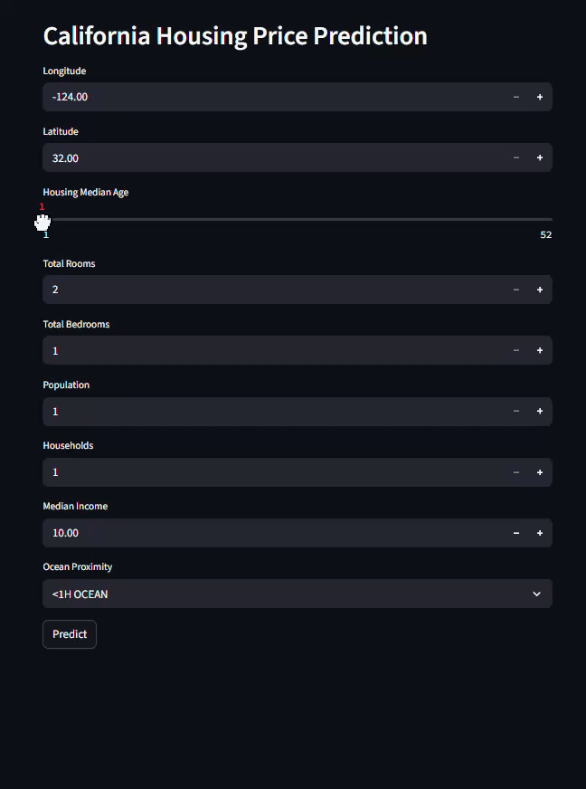

# Real Estate Price Prediction Model

This project is a machine learning model that predicts housing prices based on various features. The model is built using Python and scikit-learn and is deployed as a simple web application.

## 🚀 Features

*   Predicts housing prices using a trained machine learning model.
*   A web interface to interact with the model.
*   Jupyter Notebook with the complete data analysis and model building process.

## 📊 Dataset

The model is trained on the California Housing dataset. The dataset is located in the `datasets/housing` directory. It contains information such as median house value, median income, housing median age, total rooms, total bedrooms, population, households, latitude, and longitude.

## 🏁 Getting Started

These instructions will get you a copy of the project up and running on your local machine for development and testing purposes.

### Prerequisites

Make sure you have Python installed on your system. You can download it from [python.org](https://www.python.org/).

You will also need `pip` to install the project dependencies.

### Installation

1.  **Clone the repository:**
    ```bash
    git clone <your-repository-url>
    cd Real_Estate_Price_prediction_Model_fresh
    ```

2.  **Create a virtual environment (recommended):**
    ```bash
    python -m venv .venv
    source .venv/Scripts/activate  # On Windows
    # . .venv/bin/activate  # On macOS/Linux
    ```

3.  **Install the required dependencies:**
    *(Note: A `requirements.txt` file is not present. You can create one using `pip freeze > requirements.txt` after installing the packages below.)*
    ```bash
    pip install pandas scikit-learn flask
    ```

## 🏃‍♀️ Usage

### Jupyter Notebook

To see the data analysis, feature engineering, and model training process, you can run the Jupyter Notebook:

1.  Install Jupyter Notebook:
    ```bash
    pip install jupyter
    ```
2.  Navigate to the `Jupiter_notebook` directory and run the notebook:
    ```bash
    cd Jupiter_notebook
    jupyter notebook Housing.ipynb
    ```

### Web Application

To run the web application and interact with the prediction model:

1.  Navigate to the `web_app` directory:
    ```bash
    cd web_app
    ```
2.  Run the Flask application:
    ```bash
    python app.py
    ```
3.  Open your web browser and go to `http://127.0.0.1:5000` (or the address shown in the terminal).

## 📁 Project Structure

```
.
├── create_model.py             # Script to train and save the model
├── datasets/
│   └── housing/                # Housing dataset
├── Jupiter_notebook/
│   ├── Housing.ipynb           # Jupyter Notebook for analysis and modeling
│   └── *.joblib                # Saved model and pipeline files
└── web_app/
    ├── app.py                  # Flask web application
    ├── custom_transformer.py   # Custom transformer for the ML pipeline
    └── model/                  # Saved model for the web app
```

## 🤖 Model

The project uses a machine learning model (e.g., Linear Regression, Decision Tree, or RandomForest) trained on the housing dataset. The complete pipeline, including data preprocessing and the model, is saved in `.joblib` files. The `create_model.py` script can be used to retrain and save a new model.




## 🤝 Contributing

Contributions are welcome! Please feel free to submit a pull request.

1.  Fork the Project
2.  Create your Feature Branch (`git checkout -b feature/AmazingFeature`)
3.  Commit your Changes (`git commit -m 'Add some AmazingFeature'`)
4.  Push to the Branch (`git push origin feature/AmazingFeature`)
5.  Open a Pull Request

## 📄 License

This project is licensed under the MIT License - see the [LICENSE.md](LICENSE.md) file for details (you'll need to create this file).
